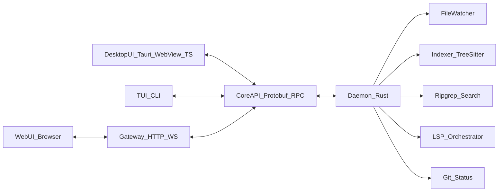

# Gouide system architecture (MVP-first, scalable)

## Goals and non-goals

- **Goal**: A fast, stable IDE that scales to large repos by keeping heavy work in a **Rust core**, while enabling multiple frontends (desktop/web/mobile/headless) to share a single API surface.
- **Goal**: **Typesafe, versioned contracts** between core and UIs, enforced by **pre-commit + CI** (breakage is caught at PR time).
- **Non-goal (MVP)**: A fully native widget toolkit or custom renderer; we optimize architecture and boundaries first, and leave renderer replacement as a future option.

## Scalability invariants (hard rules)

These are non-negotiable constraints that keep the system fast on large repos and prevent architecture drift.

### UI invariants

- **No repo-wide work in UI**: no indexing, search execution, file watching, or git scanning in the UI runtime.
- **Streaming-first UI**: UI must render partial state and progressively refine (no “must have full snapshot to show anything” flows).
- **Virtualized surfaces**: trees/lists and high-frequency streams must be virtualized/coalesced to avoid UI jank.
- **Disposable UI cache**: UI local state is a cache; core owns canonical state and can always rebuild UI state via queries/streams.

### Core invariants

- **Everything long-running is cancellable**: any operation that can exceed ~100ms must support cancellation (user action, navigation, new request superseding old).
- **Every stream is bounded/backpressured**: streams must not grow unbounded in memory; slow consumers must not crash the daemon.
- **Chunk/paginate large data**: file trees, search results, diffs, diagnostics lists, and logs must be chunked/paged; enforce payload size caps.
- **Prioritize interactivity**: interactive work (open file, apply edit, quick query) must preempt background work (indexing, long searches, git refresh).

## High-level architecture (hub-and-spoke)

- **Hub**: `gouide-core` (Rust) running as a **daemon process**.
- **Spokes**: UIs (desktop, web, mobile, TUI) that only:
  - render state
  - collect user input
  - call core RPCs
  - subscribe to core event streams

### Core principle

- **No indexing, search, LSP orchestration, git scanning, or file-watching in the UI runtime**. The UI stays responsive because the core owns the work.

## Process model (crash isolation + performance)

### User experience (single cohesive app, with optional background mode)

- Users install **one desktop app**. Launching it opens the IDE window and (if needed) starts the daemon automatically.
- Closing the window does **not** have to mean “quit the engine”:
  - Default: **minimize to tray / menu bar** with clear visibility that Gouide is still running.
  - Setting: **Quit on window close** (disables background mode).

### Practical process model (clients attach to a single per-user daemon)

- **Desktop MVP**:
  - `apps/desktop` (Tauri) **launches or attaches** to a per-user `gouide-daemon`.
  - UI crash does not kill the daemon; daemon can keep indexing.
  - Daemon crash triggers automatic restart + reconnect (with exponential backoff).
- **Future clients** (`apps/cli`, later web/mobile as applicable) follow the same rule:
  - **Attach if a daemon exists**, otherwise start one (unless disabled by user or policy).

### Daemon discovery (prevents orphans, supports desktop+terminal sharing)

- Use a **well-known per-user endpoint** (e.g., UDS path on Linux/macOS; named pipe on Windows).
- Maintain a small **lock + metadata** record (pid, start time, protocol version, endpoint, daemon_id) so clients can:
  - detect a running daemon
  - detect a stale/orphaned endpoint (pid missing / start time mismatch) and clean it up
  - refuse to connect if the protocol versions are incompatible
- Lock/metadata updates must be **atomic** (write-then-rename) so clients never read partial state.
- Daemon must support **multiple simultaneous clients** (multi-window desktop + CLI) with isolated subscriptions per client.

### Lifecycle policy (avoid “hidden resource hog” perception)

- When the last UI window closes:
  - if background mode enabled: daemon stays alive and shows a **tray/menu bar indicator** with an explicit Quit action
  - if background mode disabled: daemon receives a **Shutdown** command and exits
- Optional safeguard: **idle timeout** (e.g., after N minutes with zero clients attached) to reduce resource usage.
- Treat each opened folder as a **workspace session** inside the daemon (ref-counted by attached clients) so idle shutdown can be correct even with multiple clients.

### Reliability/observability guardrails (MVP-friendly)

- **Local-first**: avoid opening TCP ports on desktop by default (prevents firewall prompts and reduces attack surface).
- **Structured logging**: daemon writes rotating logs; UI can surface “View logs” for debugging.
- **Crash recovery**: clients reconnect on daemon restart; daemon restarts language servers on failure.
- **Resource caps**: configure indexer/search concurrency to avoid saturating low-end machines; expose a basic “Performance” setting later.

### Perf & observability (regression-resistant)

- **Tracing**: every RPC and background job must emit `tracing` spans with durations and key dimensions (workspace, language, operation type).
- **Metrics (MVP set)**: queue depths, active jobs, indexing throughput, search latency (first result + total), memory usage, and dropped/coalesced event counts.
- **Initial performance budgets (targets)**:
  - Open file (warm cache): target < 50ms to first paint in UI, p95 < 150ms (excluding syntax/lsp enrichment).
  - Search: first results streaming within 200ms for typical queries; p95 < 1s on large repos (with early cutoff available).
  - File tree expand: p95 < 100ms for directories with cached metadata (with pagination for huge dirs).
- **Bench harness policy**: core crates that can regress (search/index/git) should have micro-benchmarks and at least one “large repo fixture” profile scenario.

## Contracts & communication (typesafe + multi-language)

### Recommended contract stack

- **IDL**: Protobuf (or equivalent IDL) as the single source of truth.
- **Codegen**:
  - Rust: `prost` (or similar)
  - TypeScript: `buf`-generated TS types (or equivalent)
- **Transport**:
  - **Local** (desktop): gRPC over **Unix domain socket** (Linux/macOS) / **named pipe** (Windows)
  - **Remote** (future): gRPC over TCP + TLS
  - **Browser compatibility** (future): add a lightweight HTTP/WebSocket gateway (core-side) that maps to the same protobuf messages.

### Why not “just JSON”

- JSON is easy but tends to drift. With an IDL + codegen, the repo gets **compile-time type safety**, plus **breaking-change detection**.

### Code generation policy (hard rule)

- **Do not commit generated artifacts** (TS or Rust).
- CI and local builds must run generation as an explicit step so every build uses the latest source-of-truth IDL.
- Recommended workflow:
  - `pnpm gen` runs protobuf→TS generation into `packages/protocol/src/gen` (gitignored)
  - `cargo xtask gen` (or similar) runs protobuf→Rust generation (either via build scripts or into a crate; also not committed)
  - `pnpm build` / `pnpm test` depend on `gen`

### Version negotiation (prevents silent mismatches)

- Core and clients must exchange **protocol version** on connect.
- If incompatible, clients must show a clear error (“update Gouide”) and refuse to run against an unknown contract.

### Connection handshake (required)

- First call on any transport is a `Hello -> Welcome` exchange to establish compatibility and limits.
  - `Hello`: `protocol_version`, `client_id`, `client_name`, `capabilities` (e.g., supports_chunking, supports_sequences).
  - `Welcome`: `protocol_version`, `daemon_id`, `workspace_limits` (max_message_bytes, max_in_flight, recommended_page_size).
- Handshake failure is **fast-fail** and must not leave half-open sessions.

### Request IDs, retries, and idempotency

- All mutating and/or long-running requests must include a `request_id` (UUID or monotonic client-generated token).
- The daemon must be able to detect duplicate `request_id` and respond safely (idempotent semantics or explicit “already applied” responses).

### Cancellation (required)

- Any request that can exceed ~100ms must be cancellable by:
  - client-side cancellation (dropping the request / gRPC cancellation), and/or
  - an explicit `Cancel { request_id }` control RPC for bridge transports.
- Cancellation must stop work promptly and must release memory/queues associated with the request.

### Streaming semantics (ordering, sequencing, deltas)

- Every server stream must specify:
  - **ordering** guarantees (if any),
  - **dedupe keys** (how the client collapses repeated updates),
  - **delta semantics** (add/update/remove vs full snapshot),
  - and a monotonic `sequence` so clients can detect gaps and recover (re-subscribe or request snapshot).
- Streams must be designed so the UI can start rendering before complete data is available (progressive refinement).

### Backpressure and bounded queues (required)

- All daemon-to-client event queues must be bounded. When limits are hit, the daemon must:
  - coalesce updates when safe (e.g., “git status changed” signals), or
  - drop intermediate deltas with a “reset required” marker so clients can re-sync via snapshot RPC.

### Payload sizing, chunking, and pagination (required)

- Enforce message size limits and avoid sending huge payloads in a single response.
- Use chunking/pagination for:
  - search results (stream chunks with caps and early cutoff),
  - file trees (paged directory listing),
  - diffs (paged hunks),
  - diagnostics lists (paged + incremental).

## Data flow and state model

- **Request/Response RPCs** for discrete operations (open file, save, run search).
- **Server streams** for continuous updates (diagnostics, index progress, git status, file watch events).
- **Incremental updates**:
  - Prefer deltas over full snapshots (important for large projects).
  - UI applies deltas to a local store.

## Core runtime model (scheduling, prioritization, and coalescing)

The daemon must stay responsive under load by classifying work, bounding concurrency, and preferring interactive requests.

### Task classes

- **Interactive**: open file, apply edit, small metadata queries, UI-driven quick searches.
- **Background**: indexing, long searches, git refresh, LSP background maintenance.

### Scheduler/concurrency rules

- Use **bounded** concurrency with separate pools/limits for:
  - IO-bound work (watcher, git, reading files),
  - CPU-bound work (parsing/indexing),
  - external processes (ripgrep, language servers).
- Interactive tasks must be able to **preempt** background tasks (pause or deprioritize background queues).
- Coalesce high-frequency event sources:
  - file watcher bursts (debounce + batch),
  - git refresh triggers (debounce),
  - LSP request storms (dedupe by document + version).

### Data ownership and stable IDs

- Core owns canonical state; UI state is a cache derived from core state.
- Use stable IDs for long-lived entities (workspace_session_id, buffer_id, search_id, stream_id) so streams can send deltas reliably.

### Suggested mermaid view

## Rust core internal modules (MVP set)

Design the core as a Rust workspace with small crates so it stays “web-app modular”:

- **`gouide-protocol`**: protobuf definitions + generated Rust types + versioning utilities.
- **`gouide-daemon`**: main process, RPC server, lifecycle, auth (later), telemetry hooks (optional).
- **`gouide-workspace`**: workspace model, open buffers, file abstraction.
- **`gouide-fs`**: file watching + virtual FS interface (supports local + remote later).
- **`gouide-index`**: incremental indexing pipeline (tree-sitter or language-specific).
- **`gouide-search`**: fast text search (ripgrep integration) with streaming results.
- **`gouide-lsp`**: manages language servers, restarts, request routing, caching.
- **`gouide-git`**: status diffing and change events (optimized, incremental).
- **`gouide-pty`** (optional MVP): terminal sessions via PTY (platform-specific).

## Desktop MVP UI (Tauri WebView)

### Frontend philosophy (matches your `apps/` + `packages/` conventions)

- **UI runtime**: TypeScript + React inside system WebView (Tauri).
- **Apps read like pseudocode**: `apps/*` compose mostly-stateless UI from `packages/*` plus a small number of app-specific hooks that wire state + side effects.
- **Hub-and-spoke frontend**: apps do not depend on each other; they depend on shared `packages/*` and the core contract.

### Shared UI strategy (atomic above platform primitives)

- **`packages/frontend/shared/ui`**: shared atomic UI kit (atoms/molecules/organisms) built on a platform-primitive interface.
- **`packages/frontend/primitives/*`**: platform primitive implementations (the “compiler/binding layer” boundary):
  - `packages/frontend/primitives/web`
  - `packages/frontend/primitives/desktop`
  - `packages/frontend/primitives/mobile`
- **DRY guarantee**: higher-level UI imports from `@gouide/primitives` (stable interface) and each app resolves it to the correct platform package at build time.

#### What a “primitive” means (standardized interface)

- **Definition**: a primitive is the **smallest renderable building block** whose implementation varies per platform (web: `div/span/button`, React Native: `View/Text/Pressable`, etc.).
- **Rules**:
  - **Primitives have no product logic** (no workspace knowledge, no core calls).
  - **Primitives expose UI fundamentals only**: layout, text, input, focus/keyboard, scrolling, overlays/portals.
  - **Import boundary**: only **atoms** in `packages/frontend/shared/ui` may import `@gouide/primitives`. Apps and higher-level shared components must not import primitives directly (enforce with eslint “boundaries” rules).
  - **Single import surface**: `@gouide/primitives` exports the interface + components; each platform package implements that same surface.

#### Recommended initial primitive set (MVP)

- **Layout**: `Box`, `Stack`, `Inline`, `Separator`, `Spacer`
- **Text**: `Text`, `CodeText`
- **Input**: `TextInput`
- **Interaction**: `Pressable`
- **Scroll**: `ScrollView` (virtualization can be introduced later as needed)
- **Overlay**: `Portal` (with `Dialog`/`Tooltip` later)

#### Design tokens (keeps UI consistent)

- `packages/frontend/shared/theme`: design tokens (colors, spacing, typography) consumed by atoms; primitives accept a constrained, token-friendly style shape.
- **Web/Desktop styling authoring**: use Tailwind, but treat it as a **derived layer**:
  - Tailwind config/preset is generated from `packages/frontend/shared/theme` tokens (tokens stay platform-neutral).
  - This keeps a single source of truth while staying future-proof for mobile and non-web renderers.

### Core connection (frontend packages)

- **`packages/protocol`**: generated TS protocol types from `protocol/` (no handwritten message shapes).
- **`packages/core-client`**: typed core client wrapper (RPC calls + streaming subscriptions + reconnection/backpressure) used by all apps.

### Transport strategy (best UX, stable protobuf contract)

- **Desktop best practice**: daemon exposes RPC over **Unix domain socket / Windows named pipe** (no open ports, avoids firewall prompts, great UX/security).
- **Why a bridge is needed**: the WebView JS runtime can’t reliably connect to UDS/named pipes directly.
- **Desktop solution**: a small **Tauri-side Rust bridge**:
  - connects to daemon over UDS/named pipe
  - exposes a narrow UI-facing API (`invoke` for unary calls + event/stream bridge for subscriptions)
  - keeps the TS UI thin and avoids localhost port management
  - enforces **bounded queues + backpressure** between daemon and WebView
  - chunks/paginates large payloads (search results, diffs, directory listings)
  - coalesces high-frequency events (progress ticks, watcher bursts) to avoid flooding the WebView
- **Future web/mobile**: add an optional **HTTP/WebSocket gateway** that maps to the same protobuf messages (browser-friendly), while keeping the protobuf contract unchanged.

### Security model (local IPC)

- Desktop IPC endpoints must be **per-user** and protected:
  - Unix socket file permissions restricted to the current user
  - Windows named pipe ACL restricted to the current user
- Any future remote mode must be opt-in and authenticated (TLS + explicit trust model).

### Editor surface (MVP)

- Start with **Monaco** in desktop to ship quickly, but keep an `EditorAdapter` interface in `packages/frontend/shared/editor` so the editor surface can be swapped later.

## Extension model (don’t repeat VS Code’s pitfalls)

- **MVP**: no third-party extensions; only built-in “modules” inside core.
- **Phase 2**: extensions run out-of-process with a strict capability model:
  - plugin host process (Rust/WASI/other) communicates via the same protocol
  - never execute untrusted extension code on the UI thread

## Repository layout (monorepo, contract-first)

A concrete, scalable layout:

- **Rust core (hub)**:
  - [`core/`](core/) Rust workspace (daemon + crates)
  - [`protocol/`](protocol/) protobuf IDL + buf config

- **Apps (spokes)**:
  - [`apps/desktop/`](apps/desktop/) Tauri shell + desktop app entrypoints
  - [`apps/web/`](apps/web/) (future) browser app
  - [`apps/mobile/`](apps/mobile/) (future) React Native app
  - [`apps/cli/`](apps/cli/) headless/TUI client

- **Packages (shared, frontend-first)**:
  - [`packages/protocol/`](packages/protocol/) generated TS protocol types (generated at build time; not committed)
  - [`packages/core-client/`](packages/core-client/) typed core client (transport + streaming)
  - [`packages/frontend/shared/ui/`](packages/frontend/shared/ui/) shared atomic UI kit
  - [`packages/frontend/shared/hooks/`](packages/frontend/shared/hooks/) reusable hooks (core subscriptions, commands)
  - [`packages/frontend/shared/state/`](packages/frontend/shared/state/) shared state models (tabs, layout, view models)
  - [`packages/frontend/shared/editor/`](packages/frontend/shared/editor/) editor adapter boundary
  - [`packages/frontend/primitives/web/`](packages/frontend/primitives/web/) primitives for web
  - [`packages/frontend/primitives/desktop/`](packages/frontend/primitives/desktop/) primitives for desktop
  - [`packages/frontend/primitives/mobile/`](packages/frontend/primitives/mobile/) primitives for mobile

- **Repo tooling**:
  - [`tools/`](tools/) dev scripts, codegen helpers
  - [`docs/`](docs/) architecture, contributing, protocol versioning

## Developer workflow (DX baseline)

The repo must be “clone and go”, with deterministic codegen and consistent commands across platforms.

- **Bootstrap**:
  - `pnpm i`
- **Generate contracts (always from source-of-truth `protocol/`)**:
  - `pnpm gen` (protobuf → TS; output is gitignored)
  - `cargo xtask gen` (protobuf → Rust; output is not committed)
- **Build/test**:
  - `pnpm dev` (turbo pipeline for apps/packages)
  - `pnpm lint` / `pnpm typecheck` / `pnpm test`
  - `cargo test`

### Determinism rules

- Pin toolchains (Rust toolchain version; Node + pnpm versions).
- Use `buf` with a lockfile so generation is reproducible.
- Never rely on committed generated outputs; builds/typechecks must depend on generation steps.

## CI/CD and pre-commit enforcement (avoid breaking spokes)

- **Pre-commit** (local):
  - Rust: `fmt`, `clippy`, tests
  - TS: `lint`, `typecheck`, tests (run through `turbo`, scoped by affected packages where possible)
  - Protocol: `buf lint`, `buf breaking` (against main)
  - Generation: `pnpm gen` (and Rust generation step) so typecheck/build always uses the latest contract
- **CI matrix**:
  - Build core + desktop app on **Windows/macOS/Linux**
  - Run `pnpm gen` before any TS builds; run Rust generation/build steps as part of core build
  - Run `turbo` pipelines to typecheck affected packages/apps (so a protocol change that breaks any frontend is flagged)
  - Run contract checks ensuring all apps compile against generated protocol types and `packages/core-client`
- **Compatibility policy**:
  - Semver the protocol package (or versioned namespaces)
  - Breaking changes require a major bump and migration notes

## MVP feature slice (what the architecture must support)

- **Workspace**: open folder, file tree, open/save buffers
- **Editor**: syntax highlighting, basic diagnostics
- **Language**: LSP integration for at least one language (e.g., TS)
- **Search**: workspace search streaming results
- **Git**: status + diff viewing
- **Terminal** (optional MVP): run commands in workspace

## Performance guardrails (baked in)

- Keep UI updates **virtualized** (trees/lists) and coalesce high-frequency updates.
- Use **streaming** APIs with backpressure (bounded queues; coalesce/drop-with-reset when necessary).
- Keep daemon work on dedicated, **bounded** pools; prioritize interactive tasks over background tasks.
- Cache aggressively in core (symbols, search, git), with clear invalidation and versioned cache keys.
- Treat the protocol as an “API product”: stable, minimal, evolvable.

### Large-repo scaling tactics (required)

- **File watching**:
  - default ignore: `.git/`, `node_modules/`, `target/`, build outputs; configurable per workspace.
  - coalesce events (batch + debounce); avoid O(N) rescans for bursty changes.
- **Indexing**:
  - incremental per-file; prioritize open/visible files first.
  - persistent on-disk cache keyed by content hash + tool versions (tree-sitter grammar version, protocol version).
- **Search**:
  - ripgrep subprocess with streaming results and configurable caps/early cutoff.
  - chunk results to keep UI responsive; avoid sending giant result sets in one payload.
- **Git**:
  - incremental status refresh; debounce triggers; avoid full diffs unless requested.
  - cache diff hunks by blob ids where possible; paginate diffs for large files.

## Open decisions (optional follow-ups)

- Mobile styling approach (when `apps/mobile` is added): NativeWind/Tailwind-style on RN vs token-to-style-object mapping in primitives. Either way, tokens remain the source of truth.

---

## Implementation TODOs (Sequential)

Each TODO is designed to be completed in a single session. Complete in order. The next agent should pick up the next pending TODO.

### TODO 1: Scaffold Monorepo ✅ DONE

- Created root configs: `package.json`, `pnpm-workspace.yaml`, `turbo.json`, `.gitignore`, `.npmrc`
- Created `tsconfig.base.json` and `packages/typescript-config/` with base/library/app configs
- Created directory structure for `apps/`, `packages/`, `core/`, `protocol/`, `tools/`, `docs/`
- Created `package.json` for each workspace member (13 packages total)
- Created `core/Cargo.toml` as empty Rust workspace
- Verified with `pnpm install` - all workspace packages resolved

### TODO 2: Define Protocol ✅ DONE

- Created `buf.yaml` with lint/breaking rules (STANDARD + COMMENTS, FILE-level breaking)
- Created `protocol/gouide/v1/common.proto`:
  - RequestId, Timestamp, Error, RetryHint, Severity
  - PaginationRequest/Response with cursor-based tokens
  - StreamMeta with sequence, delta_type, dedupe_key for streaming
  - Position, Range, FileId, BufferId, WorkspaceId
  - Capabilities, WorkspaceLimits for handshake negotiation
- Created `protocol/gouide/v1/handshake.proto`:
  - Handshake service (Connect, Disconnect, Ping)
  - Hello/Welcome messages with protocol version, capabilities, reconnect tokens
  - Control service with Cancel RPC for request cancellation
  - HandshakeError with error codes (VERSION_MISMATCH, DUPLICATE_CLIENT, etc.)
- Created `protocol/gouide/v1/workspace.proto`:
  - Workspace service (OpenWorkspace, CloseWorkspace, GetWorkspaceStatus, ListDirectory, WatchFileTree, WatchWorkspaceStatus)
  - Buffer service (OpenBuffer, CloseBuffer, SaveBuffer, GetBufferContent, ListBuffers)
  - FileEntry with type, size, git status, language detection
  - Streaming with delta types (SNAPSHOT, ADD, UPDATE, REMOVE, RESET_REQUIRED)
- Created `protocol/gouide/v1/editor.proto`:
  - Editor service (ApplyEdits, GetSyntaxTokens, WatchSyntaxTokens, GetDiagnostics, WatchDiagnostics, WatchBufferChanges, FormatBuffer, FormatSelection)
  - TextEdit for OT-style versioned edits
  - SyntaxToken with TokenType enum (22 types) and TokenModifier bitmask
  - Diagnostic with severity, code, source, related info (LSP-compatible)
- Added comprehensive versioning policy comments in all protos

### TODO 3: Codegen Pipeline ✅ DONE

- Created `protocol/buf.gen.yaml` with bufbuild/es + connectrpc/es plugins
- Updated `packages/protocol/package.json` with @bufbuild/protobuf, @connectrpc/connect deps
- Created `packages/protocol/tsconfig.json` and barrel exports (index.ts, connect.ts)
- Created `core/crates/gouide-protocol/` with tonic-build codegen
- Renamed `Connect` RPC to `Establish` to avoid tonic client method conflict
- Added `scripts/install-deps.sh` for cross-platform dependency installation
- Verified: `pnpm codegen` generates TS types, `cargo build -p gouide-protocol` compiles Rust types

### TODO 4: Scaffold Core Daemon ✅ DONE

- Created `core/crates/gouide-daemon/` with:
  - `transport/unix.rs`: UDS listener with proper permissions (0700 dir, 0600 socket)
  - `services/handshake.rs`: Handshake service (establish, disconnect, ping)
  - `services/control.rs`: Control service stub (cancel)
  - `session/manager.rs`: SessionManager with client tracking, capability negotiation
  - `discovery/lockfile.rs`: Lock file + JSON metadata for daemon discovery
  - `shutdown.rs`: Graceful shutdown coordinator (SIGTERM/SIGINT handling)
  - `server.rs`: gRPC over UDS using hyper + tonic
  - `config.rs`: DaemonConfig with workspace limits
- Created `core/crates/gouide-workspace/` stub with WorkspaceError and WorkspaceManager
- Updated `core/Cargo.toml` with new workspace members and dependencies (uuid, chrono, fs4, hyper, tower)
- Verified: `cargo build --workspace` and `cargo test --workspace` pass (20 tests)

### TODO 5: Scaffold Desktop App ✅ DONE

- Created Tauri 2.x project in `apps/desktop/` with React + Vite frontend
- Created `apps/desktop/src-tauri/` Rust backend:
  - `bridge/discovery.rs`: Daemon discovery via lock file + process validation
  - `bridge/client.rs`: gRPC client over Unix domain sockets (tonic + hyper)
  - `bridge/commands.rs`: Tauri commands (discover_daemon, connect, disconnect, ping)
- Created `packages/core-client/`:
  - `GouideClient` class with connection state machine
  - `TauriTransport` adapter for Tauri invoke commands
  - Event subscriptions and reconnection support
- Created minimal React shell UI:
  - `Shell.tsx`: Main layout with sidebar + editor area
  - `Sidebar.tsx`: Explorer placeholder
  - `EditorArea.tsx`: Editor placeholder with welcome message
  - `StatusBar.tsx`: Connection status display with retry button
  - `useDaemonConnection.tsx`: React context for connection state
- Created `scripts/install.sh` for system dependencies (Debian/Fedora/Arch/macOS)
- Created `scripts/daemon.sh` for daemon management (start/stop/status/logs/dev)
- Added npm scripts: `daemon:start`, `daemon:stop`, `daemon:status`, `desktop`
- Verified: TypeScript compiles, Vite builds, Rust compiles (with system deps)

### TODO 6: Primitives & Theme Boundaries ✅ DONE

- Created `packages/frontend/shared/theme/src/`:
  - `tokens.ts`: Design tokens (colors, spacing, typography, radii) extracted from existing CSS
  - `css.ts`: CSS variable generator function
  - `tailwind-preset.ts`: Tailwind preset generator for optional consumption
  - `index.ts`: Barrel export
- Created `packages/frontend/primitives/web/src/`:
  - `types.ts`: Shared interface types (BoxProps, StackProps, TextProps, PressableProps)
  - `utils/tokens.ts`: Token-to-CSS-variable resolution
  - `Box.tsx`, `Stack.tsx`, `Text.tsx`, `Pressable.tsx`: Primitives using CSS custom properties
  - `index.ts`: Barrel export
- Created `packages/frontend/primitives/desktop/src/`:
  - `index.ts`: Re-exports from web (Tauri uses WebView)
- Created `packages/frontend/shared/ui/src/`:
  - `atoms/Button.tsx`: Example atom using primitives
  - `atoms/index.ts`, `index.ts`: Barrel exports
- Created `eslint.config.js`:
  - ESLint 9.x flat config with `no-restricted-imports` rule
  - Blocks `@gouide/primitives*` imports everywhere except `packages/frontend/shared/ui/`
- Updated `apps/desktop/vite.config.ts`: Added `@gouide/primitives` alias to desktop implementation
- Added tsconfig.json to: theme, primitives/web, primitives/desktop, ui, hooks, editor, state
- Verified: `pnpm install`, `pnpm typecheck` pass; ESLint boundary rule blocks disallowed imports

### TODO 7: Daemon Lifecycle & Tray ✅ DONE

- Created `apps/desktop/src-tauri/src/bridge/lifecycle.rs`:
  - `get_daemon_path()`: Locates daemon binary (sidecar or dev paths)
  - `spawn_daemon()`: Starts daemon, waits for socket readiness (3s timeout)
  - `ensure_daemon()`: Returns `AlreadyRunning | Spawned | Failed` with global mutex to prevent race conditions
  - `stop_daemon()`: Sends SIGTERM for graceful shutdown
- Created `apps/desktop/src-tauri/src/bridge/tray.rs`:
  - `create_tray()`: System tray icon with menu
  - Menu items: "Show Window", "Quit"
  - Left-click shows window, double-click shows window
  - "Quit" stops daemon and exits app
- Created `apps/desktop/src-tauri/src/bridge/settings.rs`:
  - `AppSettings` struct with `quit_on_close`, `start_minimized`
  - `load_settings()`/`save_settings()` using tauri-plugin-store
  - Default: minimize to tray on close
- Updated `apps/desktop/src-tauri/src/main.rs`:
  - Added tauri-plugin-store, single-instance plugins
  - Added `.setup()` to create tray icon
  - Added `.on_window_event()` to handle close behavior (minimize to tray vs quit)
- Added new Tauri commands:
  - `ensure_and_connect`: Attach-or-spawn + connect in one call
  - `get_settings`/`set_settings`: Settings CRUD
  - `shutdown_daemon`: Stop daemon gracefully
- Updated `apps/desktop/src-tauri/tauri.conf.json`: Added `externalBin` for sidecar bundling
- Updated `apps/desktop/src-tauri/capabilities/default.json`: Added store permissions
- Created `scripts/prepare-sidecar.sh`: Builds daemon and copies with target triple suffix
- Updated `scripts/install.sh`: Added protobuf installation for all platforms (macOS, Debian, Fedora, Arch)
- Updated `packages/core-client/src/tauri.ts`: Added `ensureAndConnect`, settings methods
- Updated `packages/core-client/src/client.ts`: Added `ensureAndConnect()` method for proper state management
- Updated `apps/desktop/src/hooks/useDaemonConnection.tsx`:
  - Uses `client.ensureAndConnect()` for proper state flow (fixes UI not updating)
  - Added `connectingRef` guard to prevent React StrictMode duplicate connections
- Updated `core/crates/gouide-daemon/src/session/manager.rs`:
  - Changed duplicate client behavior to auto-disconnect old session and allow reconnection
  - Updated test to verify reconnection with new token
- Verified: TypeScript compiles, Rust tests pass (19 tests), daemon sidecar prepared, UI state updates correctly

### TODO 8: CI Contract Enforcement ✅ DONE

**Biome Migration:**
- Installed Biome v2.3.8 and created biome.json with primitives boundary rule
- Updated all package.json scripts to use Biome for linting and formatting
- Removed ESLint and Prettier dependencies
- Verified primitives import boundary enforcement works

**Rust Hardening:**
- Created core/rustfmt.toml with strict formatting rules
- Added workspace-level clippy lints (pedantic, nursery, correctness)
- Updated all crate Cargo.toml files to inherit workspace lints
- Created core/deny.toml for supply chain security (cargo-deny)
- Configured to forbid unsafe code, warn on unwrap/expect/panic

**Pre-commit Hooks:**
- Installed husky + lint-staged
- Created .husky/pre-commit hook
- Created .lintstagedrc.json (Biome, buf lint, cargo fmt)
- Updated package.json prepare script

**GitHub Actions CI:**
- Created .github/workflows/ci.yml with multi-platform matrix (Ubuntu, macOS, Windows)
- Protocol validation job (buf lint, buf breaking)
- TypeScript job (codegen, Biome, typecheck, build, test)
- Rust job (fmt check, clippy, test, build)
- Rust security job (cargo-deny, cargo-audit)
- Dependency review for PRs

**Additional Workflows:**
- Created .github/workflows/typos.yml for spell checking
- Created .typos.toml configuration
- Created .github/dependabot.yml for automated dependency updates

**Protocol Contract Enforcement:**
- Created protocol/VERSIONING.md documenting semver policy
- Created scripts/verify-protocol-contract.sh for manual verification
- CI enforces: protocol changes → codegen → typecheck/build all consumers

**Strict Mode & Documentation:**
- Enabled exactOptionalPropertyTypes in TypeScript base config
- Added CI badges to README.md

**Verification:**
- Biome check passes on all TypeScript/JavaScript code
- Cargo clippy runs successfully with workspace lints
- Pre-commit hooks configured and tested
- All configuration files created and validated